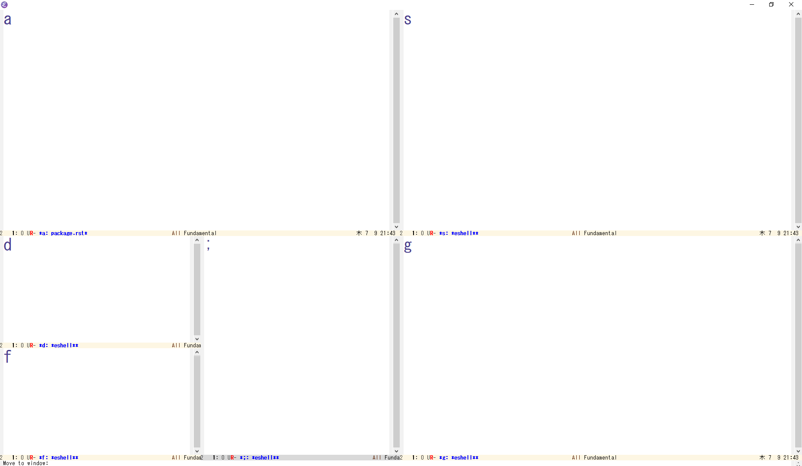

===============
 Emacs Package
===============

switch-window
=============

Emacsではウィンドウの切り替えコマンド other-window (C-x o) があります.
しかし, other-window は,
次のウィンドウに切り替えていくコマンドです.
ウィンドウを複数開いている場合には,
目的のウィンドウに辿り着くまで C-x o を連打する必要があります.
これはかなりの手間です.

switch-window を導入すれば,
この手間が軽減されます.
目的のウィンドウをキーボードで選択できるようになります.
しかも, 各ウィンドウのサイズを変更する機能もついてきます.

インストール
------------

Elpa からインストールできます.

.. code-block:: elisp

   (package-install 'switch-window)

設定
----

switch-windowコマンドを C-t に割り当てる例です.

.. code-block:: elisp

   (global-set-key (kbd "C-t") 'switch-window)

複数のウィンドウを開いている状態で C-t を実行すると,
各ウィンドウに数字が表示されます.
この状態で数字をタイプすると, その数字のウィンドウに切り替わります.

これで十分かもしれませんが,
もう少し使い勝手を良くしましょう.
数字ではなく, アルファベットで移動できるように変更します.

.. code-block:: elisp

   (setq switch-window-shortcut-style 'qwerty)

今度は, キーボードのホームポジションに並んでいるキー (asdfjkl;) で選択できるようになります.

ウィンドウが2個の場合は, わざわざ選択する必要はないので,
アルファベットを出さないように変更します.

.. code-block:: elisp

   (setq switch-window-threshold 2)

アスキーアートや画像を使うこともできます.

.. code-block:: elisp

   (setq switch-window-shortcut-appearance 'asciiart) ;; アスキーアート

.. code-block:: elisp

   (setq switch-window-shortcut-appearance 'image) ;; 画像

ウィンドウを選択する画面で,
ウィンドウのサイズを変更することができます.
例えば i をタイプすると,
上にあるウィンドウの高さが小さくなり,
下にあるウィンドウの高さが大きくなります.

その他,
ウィンドウを選択する画面でのサイズ変更は,
以下の表のものがあります.

.. list-table::

   * - i
     - 上
   * - k
     - 下
   * - j
     - 左
   * - l
     - 右
   * - b
     - 全てのウィンドウのバランスを整える.

他のウィンドウ操作も設定しましょう.

.. code-block:: elisp

   (global-set-key (kbd "C-x 1") 'switch-window-then-maximize)
   (global-set-key (kbd "C-x 2") 'switch-window-then-split-below)
   (global-set-key (kbd "C-x 3") 'switch-window-then-split-right)
   (global-set-key (kbd "C-x 0") 'switch-window-then-delete)

   (global-set-key (kbd "C-x 4 d") 'switch-window-then-dired)
   (global-set-key (kbd "C-x 4 f") 'switch-window-then-find-file)
   (global-set-key (kbd "C-x 4 m") 'switch-window-then-compose-mail)
   (global-set-key (kbd "C-x 4 r") 'switch-window-then-find-file-read-only)

   (global-set-key (kbd "C-x 4 C-f") 'switch-window-then-find-file)
   (global-set-key (kbd "C-x 4 C-o") 'switch-window-then-display-buffer)

   (global-set-key (kbd "C-x 4 0") 'switch-window-then-kill-buffer)
