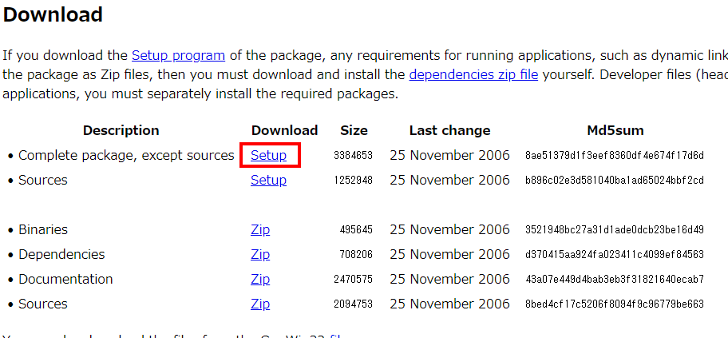
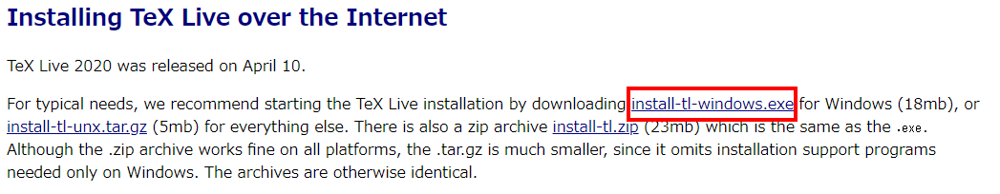

==============
 インストール
==============

Pythonのインストール
====================

ダウンロード
------------

下記ページから, インストーラをダウンロードします.

https://www.python.org/downloads/

.. figure:: images/install/python-download.png
            

インストール
------------

1. インストーラを起動します.

   .. figure:: images/install/python-run-installer.png
   

2. 「Add Python 3.8 to PATH」にチェックを入れます.

   .. figure:: images/install/python-add-path.png

3. 「Install Now」をクリックします.

   .. figure:: images/install/python-exec-install.png

4. 「Disable path length limit」をクリックします.

   .. figure:: images/install/python-path-length.png

5. 「Close」をクリックし, インストーラを閉じます.

   .. figure:: images/install/python-close-installer.png

動作確認
--------

コマンドプロンプトを起動し, ``python -V`` を実行し,
バージョンが表示されればインストール成功です.

::
   
   C:\>python -V
   Python 3.8.3

Sphinxのインストール
====================

インストール
------------

コマンドプロンプトを起動し, 以下のコマンドを実行します.

::

   C:\>pip install sphinx Pillow

動作確認
--------

コマンドプロンプトを起動し, 以下のコマンドを実行し,
バージョンが表示されればインストール成功です.

::

   C:\>sphinx-quickstart --version
   sphinx-quickstart 3.1.1

Make of Windowsのインストール
=============================

ダウンロード
------------

下記ページから, インストーラをダウンロードします.

http://gnuwin32.sourceforge.net/packages/make.htm

インストール
------------

1. インストーラを起動し, デフォルト設定のままインストールします.

2. システム環境変数 ``Path`` に, ``C:\Program Files (x86)\GnuWin32\bin``
   を追加します.

動作確認
--------

コマンドプロンプトを開き, 以下のコマンドでバージョンが表示されれば,
インストール成功です.

::

   C:\>make -version
   GNU Make 3.81
   Copyright (C) 2006  Free Software Foundation, Inc.
   これはフリーソフトウェアです. 利用許諾についてはソースを
   ご覧ください.
   商業性や特定の目的への適合性の如何に関わらず, 無保証です.

TeX Liveのインストール
======================

ダウンロード
------------

下記ページから, インストーラをダウンロードします.

http://www.tug.org/texlive/acquire-netinstall.html

インストール
------------

インストーラを起動し, デフォルト設定のままインストールします.
ただし, TeXworksは特に利用しないので,
不要の場合はチェックを外して下さい.

.. figure:: images/install/texlive-texworks.png
            

動作確認
--------

コマンドプロンプトを開き, 以下のコマンドでバージョンが表示されれば,
インストール成功です.

::

   C:\>platex -version
   e-pTeX 3.14159265-p3.8.3-191112-2.6 (utf8.sjis) (TeX Live 2020/W32TeX)
   kpathsea version 6.3.2
   ptexenc version 1.3.8
   Copyright 2020 D.E. Knuth.
   There is NO warranty.  Redistribution of this software is
   covered by the terms of both the e-pTeX copyright and
   the Lesser GNU General Public License.
   For more information about these matters, see the file
   named COPYING and the e-pTeX source.
   Primary author of e-pTeX: Peter Breitenlohner.
