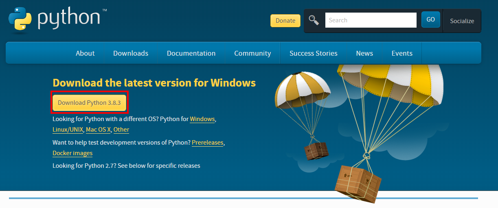

==============
 インストール
==============

Pythonのインストール
====================

ダウンロード
------------

下記ページから, インストーラをダウンロードします.
https://www.python.org/downloads/

            

インストール
------------

1. インストーラを起動します.

   .. figure:: images/install/python-run-installer.png
   

2. 「Add Python 3.8 to PATH」にチェックを入れます.

   .. figure:: images/install/python-add-path.png

3. 「Install Now」をクリックします.

   .. figure:: images/install/python-exec-install.png

4. 「Disable path length limit」をクリックします.

   .. figure:: images/install/python-path-length.png

5. 「Close」をクリックし, インストーラを閉じます.

   .. figure:: images/install/python-close-installer.png

動作確認
--------

コマンドプロンプトを起動し, ``python -V`` を実行し,
バージョンが表示されればインストール成功です.

::
   
   C:\>python -V
   Python 3.8.3

Sphinxのインストール
====================

インストール
------------

コマンドプロンプトを起動し, 以下のコマンドを実行します.

::

   C:\>pip install sphinx Pillow

動作確認
--------

コマンドプロンプトを起動し, 以下のコマンドを実行し,
バージョンが表示されればインストール成功です.

::

   C:\>sphinx-quickstart --version
   sphinx-quickstart 3.1.1

Make of Windowsのインストール
=============================

TeX Liveのインストール
======================
